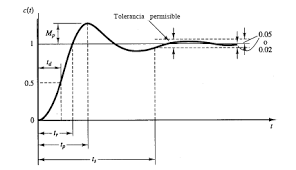
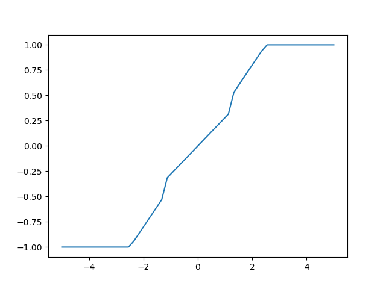
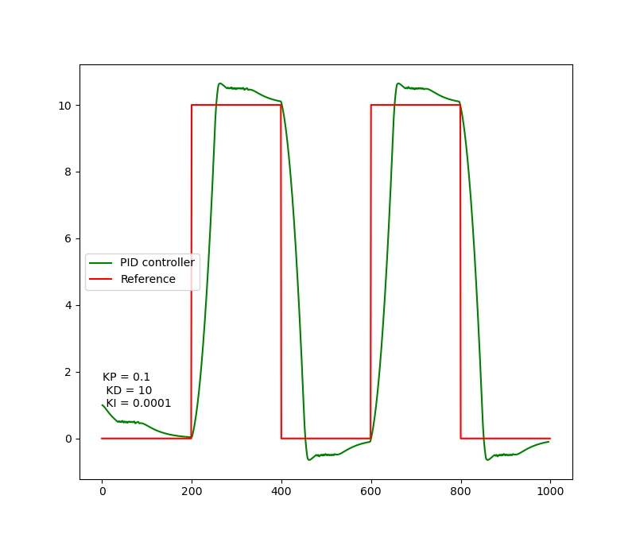
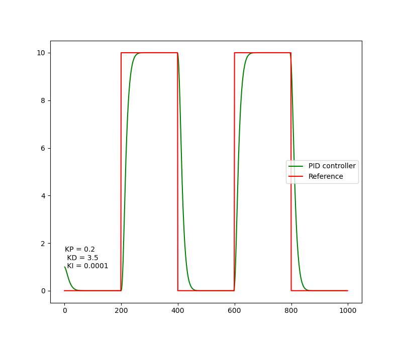
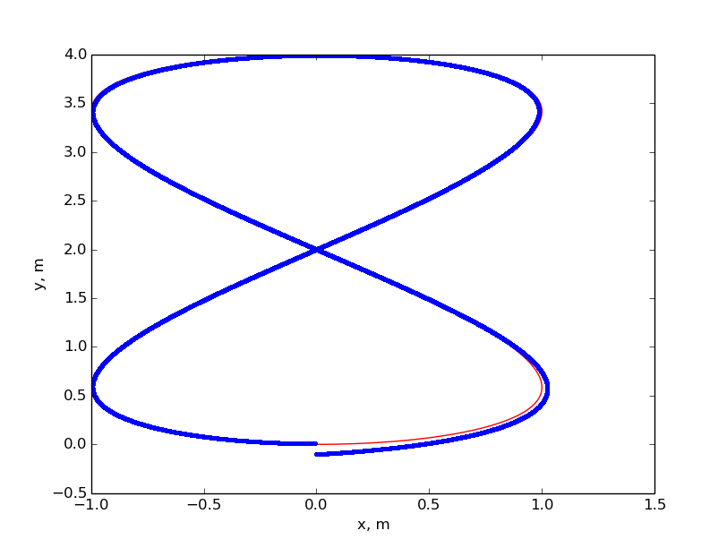

# CarND-Controls-PID
Self-Driving Car Engineer Nanodegree Program

# Reflection

## Describe the effect each of the P, I, D components had in your implementation.

In this project I used two PID controllers controlers. One for steering and one for throttle. The car drives successfully around the track. The speed was set to 40mph.

The most important parameter out of the three was the Derivative. The Proportional gain tend to cause high osciliations but it reaches the desired trajectory "quickly". In my case I noticed that the "I" component has not a high impact. Maybe the car from simulator doesn't consist in an Ackerman one. Sebastian explained the systematic bias. I understood that Ackerman motion models tend to have this bias, as the wheels are not alined. 

The main program main.cpp handles the communication via uWebSockets to the simulator. Two instances of the PID class (one for steering and one for throttle/braking) are created and initialized with the chosen parameters. Both PID controllers are fed every time there is new information coming from the simulator. I passed the CTE to the PID controlling the steering, which is used to update/compute de PID error and return the steering value. The same is done with the PID controlling the throttle, but in this case we give the difference of the current speed of the car and the reference speed (which is set to 40mph in our case).

## Describe how the final hyperparameters were chosen

Firstly, I would like to point the importance of having the correct motion model of the vehicle. If we would have it, it would be enough to run the twiddle algorithm in a python script, just as Sebastian did. 
We can notice that the model of the vehicle is way different, because it doesn't behave the same in the graphic Simulator. The first thought I had, was to try to find the motion model of the vehicle from the simulator, so that I could find the best gains Kp, Kd, Ki with the less processing.
My initial idea was to find the transfer function, by measuring the maximum overshoot. However, I did not find the way to set the vehicle at pre-defined coordinates, then record the cross track error and obtain the transfer function of the system.


Then I thought to implement a fuzzy control. The idea of the fuzzy control is to map the error to the control unit input. In this case is not necesary to know the exact motion model. 
It's enough to know the contrsaints of the system. In this case the maximum speed and the maximum steering angle. As well as to know how much important is the error. For example, to keep the car in the centre of the lane, we know that to be in the range of 10-15 cm is ok, we could consider this offset as "correct". As the error increments, we should penalize it differently. In other words, if the CTE (Cross Track Error) is less than 15cm, we would like to make little changes in the steering, but as it the CTE increses, we should put a different weight according to it. I tried the following fuzzy controler for the steering. I coded it using if statements. It should be smooth following Sugeno's methodologie.


I got the following response for the system.
 

Then I just tried to manually tweak the parameters. I arrived to a better result.


I also traied with a different trajectory and it performed awesome!


I decided to prove different gains by do it directly on the simulator. However I used two controlers. One for steering and one for throttle.

The parameters were chosen manually and iteratively after trial and error driving autonomously around the track. I started with the recommended parameters presented along Sebastian Thrun's PID class, which worked fairly well, and then improved upon that.

My final parameters for steering were Kp=0.2, Kd=3.5 and Ki=0.0001. My impression was that systemic bias in the simulator (for steering purposes) is really low, since I did not observe noticeable changes in the results when setting Ki to zero.

For handling the throttle I finally chose Kp=0.2, Kd=0.5 and Ki=0.0001. 

It is possible to improve the driving behaviour by further tuning the parameters (either manually or optimizing with for example the Twiddle algorighm). In the future I'll try to improve my fuzzy logic approach. And even try other type of algorithms such as MPC.

In addition, I will try to get the transer function of the car. So that, the obtention of the K gains would be easier to get, no matter the structure of the vehicle.

---

## Dependencies

* cmake >= 3.5
 * All OSes: [click here for installation instructions](https://cmake.org/install/)
* make >= 4.1(mac, linux), 3.81(Windows)
  * Linux: make is installed by default on most Linux distros
  * Mac: [install Xcode command line tools to get make](https://developer.apple.com/xcode/features/)
  * Windows: [Click here for installation instructions](http://gnuwin32.sourceforge.net/packages/make.htm)
* gcc/g++ >= 5.4
  * Linux: gcc / g++ is installed by default on most Linux distros
  * Mac: same deal as make - [install Xcode command line tools]((https://developer.apple.com/xcode/features/)
  * Windows: recommend using [MinGW](http://www.mingw.org/)
* [uWebSockets](https://github.com/uWebSockets/uWebSockets)
  * Run either `./install-mac.sh` or `./install-ubuntu.sh`.
  * If you install from source, checkout to commit `e94b6e1`, i.e.
    ```
    git clone https://github.com/uWebSockets/uWebSockets 
    cd uWebSockets
    git checkout e94b6e1
    ```
    Some function signatures have changed in v0.14.x. See [this PR](https://github.com/udacity/CarND-MPC-Project/pull/3) for more details.
* Simulator. You can download these from the [project intro page](https://github.com/udacity/self-driving-car-sim/releases) in the classroom.

Fellow students have put together a guide to Windows set-up for the project [here](https://s3-us-west-1.amazonaws.com/udacity-selfdrivingcar/files/Kidnapped_Vehicle_Windows_Setup.pdf) if the environment you have set up for the Sensor Fusion projects does not work for this project. There's also an experimental patch for windows in this [PR](https://github.com/udacity/CarND-PID-Control-Project/pull/3).

## Basic Build Instructions

1. Clone this repo.
2. Make a build directory: `mkdir build && cd build`
3. Compile: `cmake .. && make`
4. Run it: `./pid`. 

Tips for setting up your environment can be found [here](https://classroom.udacity.com/nanodegrees/nd013/parts/40f38239-66b6-46ec-ae68-03afd8a601c8/modules/0949fca6-b379-42af-a919-ee50aa304e6a/lessons/f758c44c-5e40-4e01-93b5-1a82aa4e044f/concepts/23d376c7-0195-4276-bdf0-e02f1f3c665d)


